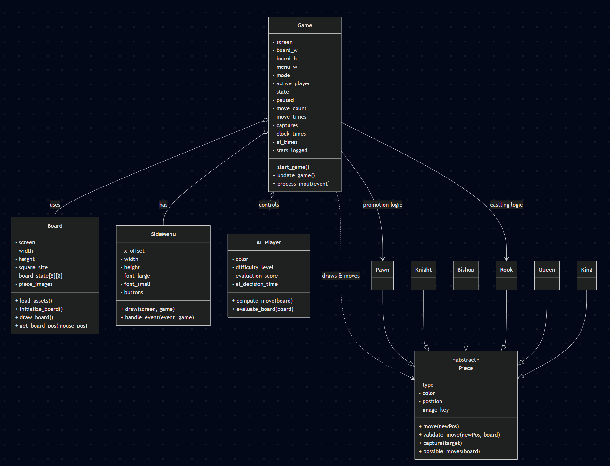

# Enhanced Chess Game for Beginners

## 1. Project Overview
This project is a chess game developed using PyGame that follows official chess rules. But this game will have additional features, such as move hints, highlighting potential captures, and displaying legal move paths— to make chess more fun and easier to learn.

## 2. Project Review
Traditional chess games typically offer only the basic board and standard rules, leaving beginners to figure out complex moves on their own. This project aims to:
- **Enhance Learning:** By providing visual cues that indicate vulnerable pieces and allowed moves.
- **Increase Interactivity:** By offering immediate feedback on valid moves and captures.
- **Improve Structure:** Through an object‑oriented approach that prepares the code base for future enhancements (such as data visualization and additional rules).

## 3. Programming Development

### 3.1 Game Concept
The game simulates a standard chess match between two players (or a human against an AI). The primary objective is to checkmate the opponent’s king. The game integrates traditional gameplay with extra visual aids to simplify learning and improve strategic play.

### 3.2 Object‑Oriented Programming Implementation
The project is structured into separate components:

- **Game:**  
  *Role:* Manages overall game flow (board state, user input, turn switching, and statistics tracking).  
  *Key Attributes:*  
  - `state`: Current status of the game (ongoing, check, checkmate).  
  - `active_player`: Which player’s turn it is.  
  - `move_count`, `move_times`, and `game_duration`: For tracking performance metrics.  
  *Key Methods:* `start_game()`, `update_game()`, `process_input()`, and  `check_end_conditions()`.

- **Board:**  
  *Role:* Handles board layout, asset loading, piece placement, and rendering.  
  *Key Attributes:*  
  - `board_state`: An 8×8 grid storing piece objects.  
  - `piece_images`: A mapping between an asset’s key (e.g., `"chess-pawn-white"`) and its image.  
  - `captured_count`: The number of pieces captured during the game.  
  *Key Methods:* `load_assets()`, `initialize_board()`, `draw_board()`, and `get_board_pos(mouse_pos)`.

- **Piece (Base Class) & Subclasses:**  
  *Role:* Defines common attributes and methods for chess pieces.  
  *Key Attributes:*  
  - `type`, `color`, `position`, and `image_key`.  
  *Key Methods:*  
  - `move()`, `validate_move()`, `capture()`, and `possible_moves()`.  
  *Subclasses:*  
  - **Pawn:** Implements pawn-specific movement (one‑step and two‑step moves on the first move) and diagonal captures.  
  - **Knight:** Implements L‑shaped moves.  
  - **Bishop:** Implements diagonal moves until blocked.  
  - **Rook:** Implements horizontal and vertical moves until blocked.  
  - **Queen:** Combines Rook and Bishop movement rules.  
  - **King:** Moves one square in any direction (future work may include castling).

- **AI_Player:** 
  Will handle computer-controlled moves. 
  - **difficulty_level:** Determines the AI's challenge level.
  - **evaluation_score:** for ai to compare each position(represent value of position as score) and use it to choose board positions.
  - **ai_decision_time:** Time taken by the AI to decide on a move.

### 3.3 Algorithms Involved
- **Move Validation:** Checking that each move abides by chess rules through each piece's `possible_moves()` method.
- **Pathfinding:** For sliding pieces (Bishop, Rook, Queen) to generate valid move paths.
- **Event Handling:** Managing user inputs (mouse clicks) and updating the game state.
- **Data Logging:** Recording gameplay metrics (number of moves, move times, etc.) for future analysis.

## 4. Statistical Data (Prop Stats)

### 4.1 Data Features
The game will record:
- **Number of Moves per Game**
- **Time Taken per Move**
- **Captured Pieces Count**
- **Overall Game Duration**
- **AI decision time.**

### 4.2 Data Recording and Analysis
- **Storage:**  
  Data will be stored in CSV format for easy access and manipulation.
- **Analysis:**  
  Basic statistical measures (mean, minimum, maximum, and standard deviation) will be calculated.

### 4.3 Data Analysis Report
- **Table Presentation:**  
  “Time Taken per Move” will be summarized in a table showing:  
  - Minimum (min)
  - Maximum (max)
  - Average (mean)
  - Standard Deviation (SD)

- **Graph Presentation:**  
  Three graphs will be generated:
  1. **Number of Moves per Game:**  
     *Graph Type:* Bar chart (each bar represents one game).
  2. **Captured Pieces Count:**  
     *Graph Type:* Stacked bar chart (possibly split by piece type or color).
  3. **Move Time Variation:**  
     *Graph Type:* Line graph (move number on the x-axis vs. move time on the y-axis).

## 5. Project Timeline

| **Week**              | **Task**                                                                                                                    |
|-----------------------|-----------------------------------------------------------------------------------------------------------------------------|
| Week 1 (10 March)     | Proposal submission / Project initiation                                                                                    |
| Week 2 (17 March)     | Full proposal submission, design UML diagram                                                                                |
| Week 3 (24 March)     | Begin development: Set up project structure, develop core classes (Game, Board, Piece, Pawn, Knight, etc.)                  |
| Week 4 (31 March)     | Implement core game mechanics: Board rendering, piece movement, capturing logic, valid move highlighting                    |
| Week 5 (7 April)      | Enhance move validation for additional pieces (Bishop, Rook, Queen, King) capturing, turn switching                         |
| Week 6 (14 April)     | Initial testing and debugging; ensure main gameplay loop is functional                                                      |
| Final Submission      | Finalize UI enhancements, comprehensive testing, complete documentation (including data visualization)|

## 6. Document Version
- **Version:** 3.0  

| **Feature**              | **Why is it good to have this data? What can it be used for?**                                                   | **How will you obtain 50 values of this feature data?**                                                                | **Which variable (and which class) will you collect this from?**                                           | **How will you display this feature data?**                                             |
|--------------------------|-------------------------------------------------------------------------------------------------------------------|------------------------------------------------------------------------------------------------------------------------|----------------------------------------------------------------------------------------------------------------|-----------------------------------------------------------------------------------------|
| **1. Number of moves**   | Helps measure how long or complex a match is. Can indicate if players are quick to finish or prolong games.       | Each completed game produces a final move count. After enough games, we will have 50 data points.                       | `move_count` from the **Game** class (increments every time a move is made).            | Bar chart or line chart showing the total moves across multiple games.                  |
| **2. Time per move**     | Useful for analyzing player speed and decision-making. Shows how quickly a player decides each move.              | Every time a move is made, store how long it took. Once 50 moves occur, we have 50 data points.                         | `move_time` in the **Game** or **Board** class (tracked via timestamps before & after). | A bar chart or histogram illustrating the distribution of individual move times.        |
| **3. Captured pieces**   | Shows how aggressive or defensive a player is. High captures indicate a more attacking style.                     | After each capture event, increment the captured piece count. By the end of 50 captures, we will have 50 data points.  | `captured_count` in the **Board** class (or updated in each **Piece** upon capture).    | A simple tally or bar chart comparing how many pieces are captured in each game.        |
| **4. Game duration**     | Reflects how quickly players reach checkmate or stalemate. Useful for analyzing the overall pacing of the game.   | Record the start and end time of each game. By the time 50 games are completed, we’ll have 50 duration data points.     | `game_duration` in the **Game** class (difference between start and end times).         | A bar chart or table showing average game duration, or a line chart comparing durations. |
| **5. AI decision time**  | Measures the efficiency of the AI. If the AI is too slow, we can optimize its algorithms or adjust difficulty.     | Each time the AI makes a move, record how long it took to calculate. After 50 AI moves, we’ll have 50 data points.      | `ai_decision_time` in the **AI_Player** class (to track AI’s evaluation time per move).  | A line chart or bar chart illustrating how the AI’s calculation time changes per move.   |

## 7. Statistical Data Revision

### 7.1 Table Presentation
We focus on “Time Taken per Move” with:
- **Minimum (min):** Shortest move time.
- **Maximum (max):** Longest move time.
- **Average (mean):** Average move time.
- **Standard Deviation (SD):** Variability of move times.

### 7.2 Graph Presentation

| **Feature Name**         | **Graph Objective**                                                      | **Graph Type**      | **X-axis**      | **Y-axis**                         |
|--------------------------|--------------------------------------------------------------------------|---------------------|-----------------|-------------------------------------|
| Number of Moves          | Compare total moves in different games                                   | Bar chart           | Game Index      | Total Moves                         |
| Captured Pieces Count    | Visualize how many pieces each side captures to show aggressiveness      | Stacked bar chart   | Game Index      | Count of Captured Pieces            |
| AI Decision Time         | Show changes in AI calculation times across moves                        | Line graph          | Move Number     | AI Decision Time (seconds)          |

## 8. Project Planning

### 8.1 Weekly Planning
- **26 March – 2 April:**  
  Finalize project structure; set up basic user interface (window, board layout); begin implementing core classes (Game, Board, Piece).

- **3 April – 9 April:**  
  Complete core Piece and Pawn classes (movement, validation, capturing); implement Knight, Bishop, Rook, Queen, and King subclasses; start data collection framework.

- **10 April – 16 April**  
  Ensure all core classes (Game, Board, Piece with subclasses) are fully functional; validate move logic (including capturing and turn switching) is in place; basic gameplay loop operates correctly; data collection for move times, move count, and captured pieces is implemented.

- **17 April – 23 April**  
  Refine move validation for each piece; integrate UI enhancements (move highlighting, visual cues); further test and debug the game loop; begin implementing CSV logging for statistical data.

- **24 April – 11 May**  
  Finalize data presentation (table and graphs for move time statistics, move count, captured pieces); complete UI polishing; perform comprehensive testing and debugging; prepare final documentation and submit project deliverables.

### 8.2 50% of Tasks by 16 April
- **By 16 April (50% Completion):**  
  - Core classes (Game, Board, Piece, Pawn, Knight, Bishop, Rook, Queen, King) are operational.
  - Basic move validation and capturing logic are implemented.
  - Turn switching and a functional gameplay loop are in place.
  - Data collection for move-related metrics is set up.
  
- **By 23 April (75% Completion):**  
  - Enhanced move validation with proper feedback.
  - UI improvements (e.g., valid move highlighting) are integrated.
  - CSV logging of game metrics and basic data analysis methods are operational.
  
- **By 11 May (Final 25% Completion):**  
  - Finalize data visualization (table and graphs).
  - Complete comprehensive testing, debugging, and documentation.
  - Submit the final project deliverables.

**Version:** 3.0

https://github.com/StewedDuck/EnhancedChessGame